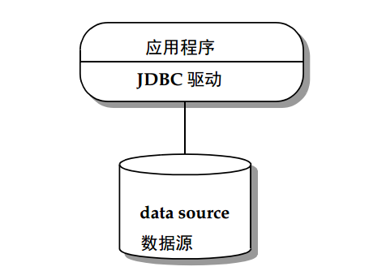
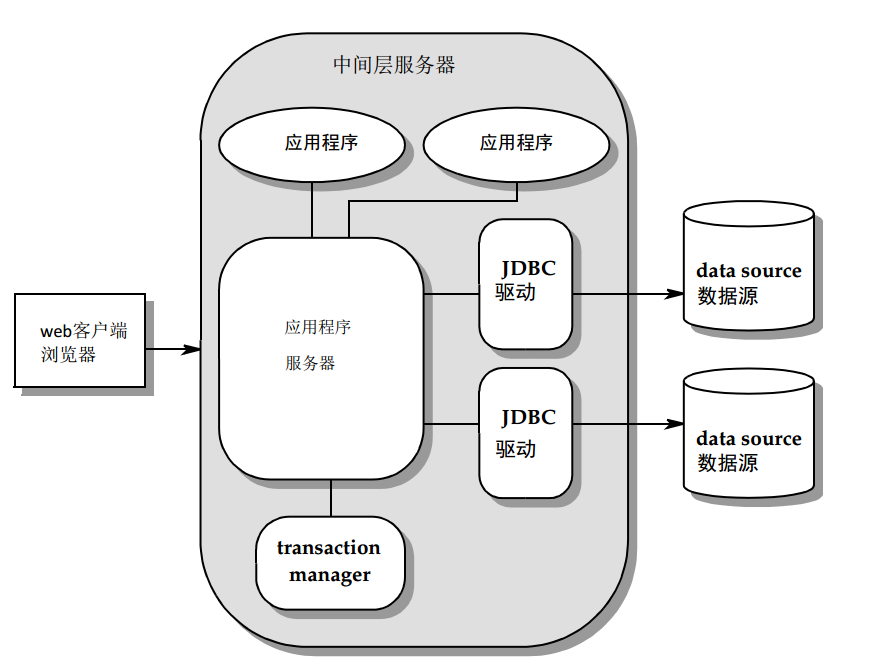

# 4. Overview（概览）

JDBC API 提供了一种方式，使 Java 程序能够访问一个或多个数据源。在大多数情况下，数据源是关系型数据库管理系统（DBMS），其数据通过 SQL 进行访问。然而，也可以在其他数据源之上实现支持 JDBC 技术的驱动程序，包括传统文件系统和面向对象的系统。JDBC API 的主要动机是为应用程序提供一个标准 API，以访问各种数据源。

本章介绍了 JDBC API 的一些关键概念。此外，它描述了两种常见的 JDBC 应用程序环境，并讨论了每种环境中不同功能角色的实现。这两种逻辑模型是两层和三层模型，它们可以在各种物理配置上实现。

## 4.1建立连接

JDBC API 定义了 `Connection` 接口，用于表示与底层数据源的连接。

在典型的场景中，JDBC 应用程序将通过以下两种机制之一连接到目标数据源：

- **DriverManager** — 这个完全实现的类是在原始 JDBC 1.0 API 中引入的。当应用程序首次尝试通过指定 URL 连接到数据源时，DriverManager 会自动加载 CLASSPATH 中找到的任何 JDBC 驱动程序（任何低于 JDBC 4.0 的驱动程序必须由应用程序显式加载）。

- **DataSource** — 这个接口是在 JDBC 2.0 可选包 API 中引入的。它优于 DriverManager，因为它允许应用程序对底层数据源的细节保持透明。DataSource 对象的属性被设置，以便它表示一个特定的数据源。当调用其 `getConnection` 方法时，DataSource 实例将返回一个到该数据源的连接。通过简单地更改 DataSource 对象的属性，可以将应用程序定向到不同的数据源；无需更改应用程序代码。同样，DataSource 实现可以在不更改使用它的应用程序代码的情况下进行更改。

JDBC API 还定义了两个重要的 DataSource 接口扩展，以支持企业应用程序。这两个扩展接口是：

- **ConnectionPoolDataSource** — 支持缓存和重用物理连接，从而提高应用程序的性能和可扩展性。

- **XADataSource** — 提供可以参与分布式事务的连接。

## 4.2  执行 SQL 语句和操作结果

### 执行 SQL 语句和操作结果

一旦建立了连接，使用 JDBC API 的应用程序可以对目标数据源执行查询和更新。JDBC API 提供了对 SQL:2003 中最常见实现特性的访问。由于不同的供应商在这些特性的支持程度上有所不同，JDBC API 包含了 `DatabaseMetadata` 接口。应用程序可以使用此接口来确定它们使用的数据源是否支持特定的功能。JDBC API 还定义了转义语法，允许应用程序访问非标准的供应商特定功能。使用转义语法的好处在于，JDBC 应用程序可以访问与本地应用程序相同的功能集，同时保持应用程序的可移植性。

应用程序使用 `Connection` 接口中的方法来指定事务属性并创建 `Statement`、`PreparedStatement` 或 `CallableStatement` 对象。这些语句用于执行 SQL 语句和检索结果。`ResultSet` 接口封装了 SQL 查询的结果。语句也可以批量处理，允许应用程序将多个更新作为一个执行单元提交到数据源。

JDBC API 通过扩展 `ResultSet` 接口引入了 `RowSet` 接口，从而提供了一个比标准结果集更具多功能性的表格数据容器。`RowSet` 对象是一个 JavaBeans 组件，它可以在不连接到数据源的情况下操作。例如，`RowSet` 实现可以是可序列化的，因此可以通过网络发送，这对于希望在不承担 JDBC 驱动程序和数据源连接开销的情况下处理表格数据的小型客户端特别有用。`RowSet` 实现的另一个特性是，它可以包括一个自定义读取器，用于访问任何表格格式的数据，而不仅仅是关系数据库中的数据。此外，`RowSet` 对象可以在与数据源断开连接时更新其行，其实现可以包括一个自定义写入器，将这些更新写回到底层数据源。

### 4.2.1 支持 SQL 高级数据类型

JDBC API 定义了将 SQL 数据类型转换为 JDBC 数据类型及其反向转换的标准映射。这包括对 SQL:2003 高级数据类型的支持，例如 BLOB、CLOB、ARRAY、REF、STRUCT、XML 和 DISTINCT。JDBC 驱动程序还可以实现一个或多个自定义类型映射，用于用户定义类型（UDTs），其中 UDT 映射到 Java 编程语言中的一个类。JDBC API 还支持外部管理的数据，例如数据源外部的文件中的数据。

 
 ## 4.3两层模型

两层模型将功能划分为客户端层和服务器层，如图 4-1 所示。

客户端层包括应用程序和一个或多个 JDBC 驱动程序，应用程序处理以下职责：

- **展示逻辑**  
- **业务逻辑**  
- **事务管理**（包括多语句事务或分布式事务）
- **资源管理**

在这个模型中，应用程序直接与 JDBC 驱动程序交互，包括建立和管理物理连接，并处理特定底层数据源实现的细节。应用程序可以利用对特定实现的了解，利用非标准特性或进行性能调优。

这个模型的一些缺点包括：

- **展示逻辑与业务逻辑混杂于基础设施和系统级功能中**。这使得生成具有明确架构的可维护代码成为挑战。
- **应用程序的可移植性较差**，因为它们对特定数据库实现进行了调优。需要连接多个数据库的应用程序必须了解不同供应商实现之间的差异。
- **可扩展性受限**。通常，应用程序会保持一个或多个物理数据库连接直到其终止，这限制了可以支持的并发应用程序数量。在这个模型中，性能、可扩展性和可用性的问题由 JDBC 驱动程序和相应的底层数据源处理。如果应用程序处理多个驱动程序，它还可能需要了解每个驱动程序/数据源对这些问题的不同解决方式。

## 4.4三层模型

三层模型引入了一个中间层服务器，用于承载业务逻辑和基础设施，如图 4-2 所示。

这种架构旨在为企业应用程序提供更好的性能、可扩展性和可用性。功能在不同层次中划分如下：

1. **客户端层**：实现人机交互展示逻辑的薄层。Java 程序、网页浏览器和 PDA 是典型的客户端层实现。客户端与中间层应用程序交互，不需要了解基础设施或底层数据源的功能。

2. **中间层服务器**：包括以下内容的中间层：
   - 与客户端交互并实现业务逻辑的应用程序。如果应用程序需要与数据源交互，它将处理更高级的抽象，如 DataSource 对象和逻辑连接，而不是低级别的驱动程序 API。
   - 提供广泛应用程序支持基础设施的应用服务器。这可以包括物理连接的管理和池化、事务管理，以及不同 JDBC 驱动程序之间差异的掩盖。最后一点使得编写可移植应用程序变得更容易。应用服务器角色可以由 Java EE 服务器实现。应用服务器实现了应用程序使用的高级抽象，并直接与 JDBC 驱动程序交互。
   - 提供与底层数据源连接的 JDBC 驱动程序。每个驱动程序在其底层数据源支持的功能之上实现标准 JDBC API。驱动程序层可能掩盖标准 SQL:2003 语法与数据源支持的本地方言之间的差异。如果数据源不是关系型 DBMS，则驱动程序实现应用服务器使用的关系层。

3. **底层数据源**：数据存储的层次。它可以包括关系型 DBMS、传统文件系统、面向对象的 DBMS、数据仓库、电子表格或其他数据打包和呈现的方式。唯一的要求是有一个支持 JDBC API 的相应驱动程序。

## 4.5 Java EE 平台中的 JDBC

Java EE 组件（如 JavaServer Pages、Servlets 和 Enterprise Java Beans (EJB) 组件）通常需要访问关系数据，并使用 JDBC API 进行此访问。当 Java EE 组件使用 JDBC API 时，容器会管理它们的事务和数据源。这意味着 Java EE 组件开发人员不会直接使用 JDBC API 的事务和数据源管理功能。有关详细信息，请参阅 Java EE 平台规范。